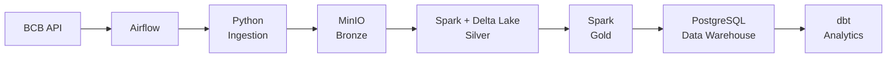
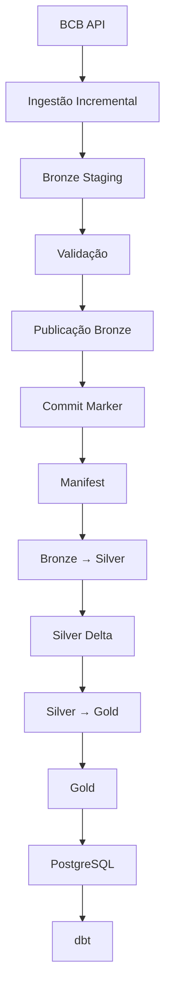
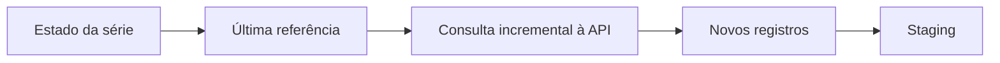
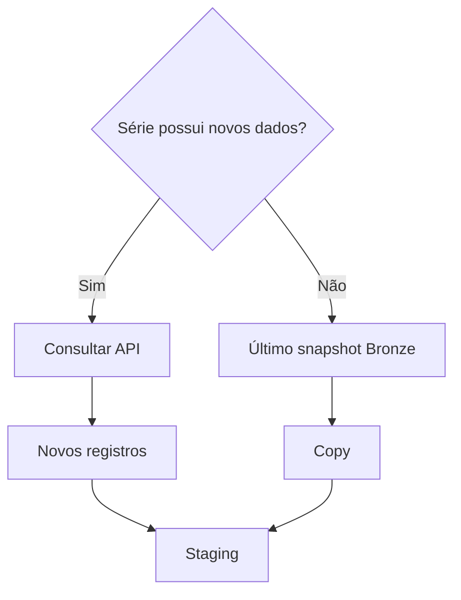
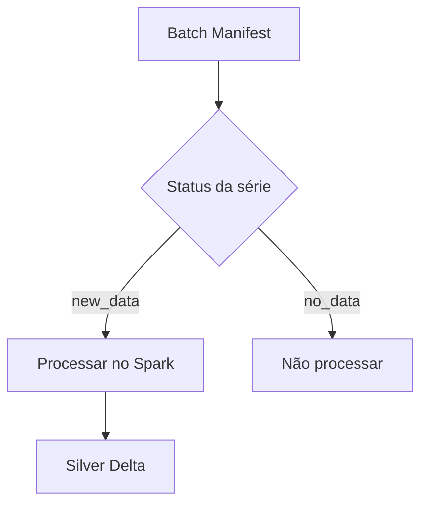
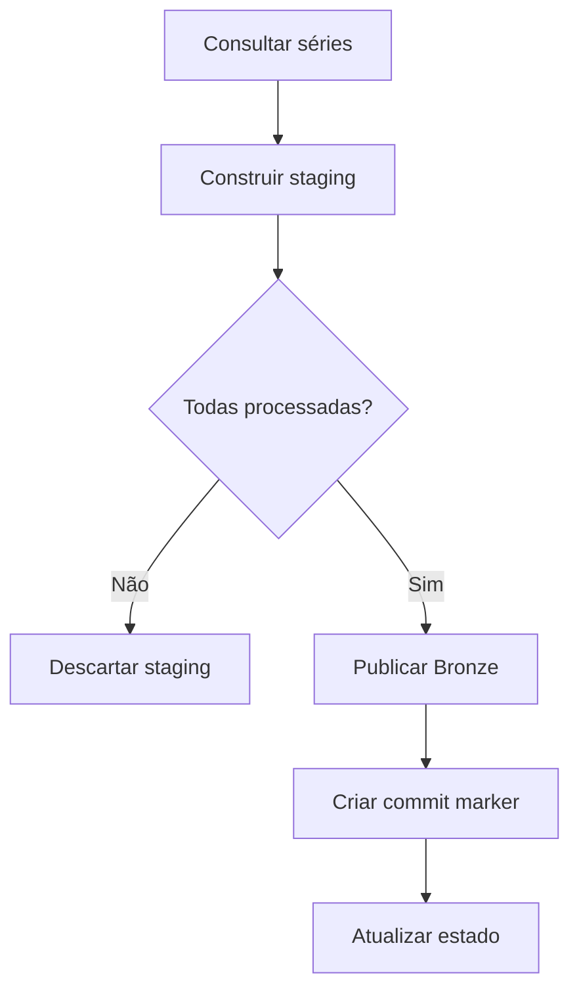
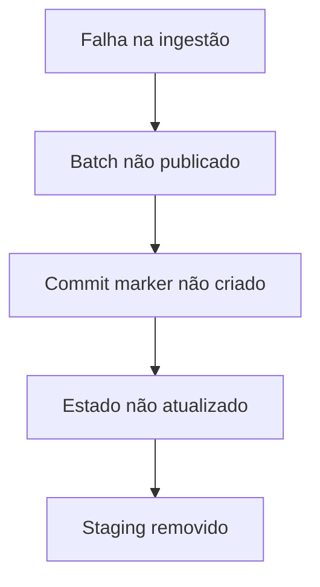
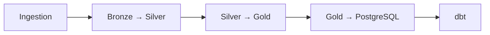

# BCB Data Pipeline

Pipeline de Engenharia de Dados desenvolvido a partir de séries históricas do **Banco Central do Brasil (BCB)**.

O projeto implementa uma arquitetura de **Data Lake + Data Warehouse**, com foco em ingestão incremental, controle de estado, processamento distribuído, rastreabilidade, consistência dos batches e preparação dos dados para consumo analítico.

O objetivo é aplicar, em um projeto completo, conceitos utilizados na construção de pipelines de dados modernos, incluindo **watermark, processamento incremental, staging, controle de batches, reprocessamento e separação entre camadas de armazenamento e consumo**.

---

## Arquitetura



### Tecnologias

| Tecnologia     | Responsabilidade                      |
| -------------- | ------------------------------------- |
| Python         | Ingestão e controle do pipeline       |
| Apache Airflow | Orquestração                          |
| Apache Spark   | Processamento e transformação         |
| Delta Lake     | Cargas incrementais na Silver         |
| MinIO          | Data Lake compatível com S3           |
| Parquet        | Armazenamento das camadas processadas |
| PostgreSQL     | Data Warehouse                        |
| dbt            | Transformações, testes e documentação |
| Docker Compose | Containerização da infraestrutura     |

---

# Fluxo de dados

O pipeline é executado seguindo as seguintes etapas:



A ingestão da API é incremental, mas cada batch publicado na Bronze representa um **snapshot completo das séries**.

---

# Bronze

A Bronze armazena os dados recebidos diretamente da API do Banco Central em formato JSON.

Os objetos são organizados por:

* Série;
* Data de ingestão;
* `batch_id`.

Estrutura:

```text
<series>/
└── ingestion_date=YYYY-MM-DD/
    └── batch_id=<batch_id>/
        └── response.json
```

O `batch_id` identifica a execução responsável pela geração daquele lote.

---

## Staging

Antes da publicação definitiva, os dados são armazenados em uma área temporária:

```text
_staging/
└── ingestion_date=YYYY-MM-DD/
    └── batch_id=<batch_id>/
        └── <series>/
            └── response.json
```

O batch permanece em staging durante todo o processo de ingestão.

Somente após todas as séries serem processadas com sucesso os dados são publicados na Bronze.

Isso evita a publicação de um snapshot parcialmente processado.

---

# Ingestão incremental

A ingestão utiliza uma **watermark baseada na data de referência de cada série do BCB**.

O estado de cada série é mantido na Bronze:

```text
_control/
└── <series>.json
```

Esse estado mantém informações como:

* última data de referência processada;
* última data de ingestão;
* `batch_id` do último batch publicado;
* quantidade de registros processados.

Durante uma nova execução:



A API não precisa ser consultada novamente desde o início do histórico.

A pipeline utiliza a última referência conhecida para determinar quais observações precisam ser incorporadas ao novo batch.

---

# Snapshot completo por batch

Embora a consulta à API seja incremental, cada batch publicado na Bronze representa uma **visão completa das séries**.

Quando uma série possui novos registros, esses registros são obtidos da API e gravados no staging.

Quando uma série não possui novos registros, o pipeline reutiliza fisicamente o conteúdo do último batch publicado.



Essa estratégia permite que cada batch seja autocontido, facilitando:

* auditoria;
* rastreabilidade;
* reconstrução de estados;
* reprocessamento;
* investigação de problemas.

---

# Manifest do batch

Cada batch possui um manifest de controle contendo o status de cada série.

O manifest é armazenado em:

```text
_control/
└── batches/
    └── ingestion_date=YYYY-MM-DD/
        └── batch_id=<batch_id>.json
```

Exemplo:

```json
{
  "batch_id": "scheduled__2026-09-13",
  "ingestion_date": "2026-09-13",
  "series": {
    "selic": "new_data",
    "ipca": "no_data",
    "dolar_venda": "no_data",
    ...
  },
  "status": "committed"
}
```

Os possíveis estados de uma série são:

| Status     | Significado                           |
| ---------- | ------------------------------------- |
| `new_data` | A série recebeu novos registros       |
| `no_data`  | Não foram encontrados novos registros |

O manifest permite que as etapas seguintes saibam exatamente quais séries foram alteradas naquela execução.

---

# Processamento seletivo

A etapa **Bronze → Silver** utiliza o manifest para processar somente as séries que receberam novos dados.



Por exemplo:

```text
selic              → new_data
ipca               → no_data
dolar_venda        → no_data
credito_livre_pf   → new_data
```

Nesse caso, o Spark processará somente:

```text
selic
credito_livre_pf
```

Séries sem alteração não precisam ser novamente lidas e processadas.

Isso reduz:

* leituras no Data Lake;
* processamento desnecessário;
* tempo de execução;
* custo computacional.

---

# Consistência e publicação

A publicação da Bronze utiliza o padrão:



O **commit marker** funciona como indicador de que o batch foi completamente publicado.

A camada Silver só processa batches que possuem um commit válido.

---

## Falha durante a ingestão

Caso qualquer série apresente erro:



Dessa forma, uma falha em uma única série não resulta na publicação de um batch parcial.

---

# Reprocessamento

A arquitetura permite reprocessar execuções que apresentaram falha sem depender de um batch parcialmente publicado.

O estado da ingestão só é atualizado após a publicação bem-sucedida.

Assim, em caso de falha:

```text
Último estado válido
        ↓
Nova execução
        ↓
Nova consulta incremental
        ↓
Novo staging
        ↓
Validação
        ↓
Publicação
```

A execução com erro não avança a watermark.

Isso permite que o pipeline seja reexecutado utilizando o último estado conhecido como referência.

---

# Silver

A Silver é responsável pelo tratamento e estruturação dos dados utilizando **Apache Spark** e **Delta Lake**.

Principais operações:

* conversão de tipos;
* tratamento de datas;
* padronização dos registros;
* remoção de duplicidades;
* controle de registros existentes;
* processamento incremental;
* atualização utilizando `MERGE`.

Os dados são particionados por ano e mês.

O Delta Lake é utilizado para manter uma camada com suporte a operações incrementais e controle dos registros já existentes.

---

# Gold

A Gold é destinada ao consumo analítico.

Os dados da Silver são consolidados em nível mensal, permitindo combinar diferentes séries econômicas e de crédito em uma estrutura analítica.

O processo inclui:

* agregação mensal;
* padronização das referências temporais;
* combinação das séries;
* transformação para formato analítico;
* organização por mês de referência.

Entre os indicadores utilizados estão:

* Selic;
* inflação;
* câmbio;
* concessão de crédito;
* inadimplência;
* atividade econômica;
* endividamento;
* comprometimento de renda.

A Gold é uma camada derivada da Silver e pode ser reconstruída a partir dos dados tratados.

---

# PostgreSQL

Os dados consolidados da Gold são carregados no PostgreSQL, formando a camada de **Data Warehouse**.

Principal tabela analítica:

```text
gold.macro_monthly
```

O PostgreSQL funciona como camada de consumo estruturado para análises e transformações posteriores.

---

# dbt

O dbt é utilizado para realizar as transformações finais dentro do Data Warehouse.

Responsabilidades:

* criação de modelos analíticos;
* transformações SQL;
* testes de qualidade;
* documentação;
* organização das dependências entre modelos.

A estrutura utiliza camadas de staging e marts para separar dados intermediários dos modelos destinados ao consumo.

---

# Orquestração

O pipeline é orquestrado pelo **Apache Airflow**.

Fluxo principal:



Cada execução possui um `batch_id`, permitindo rastrear a execução responsável pelos dados ao longo das diferentes camadas.

---

# Infraestrutura

Todo o ambiente é executado utilizando **Docker Compose**, permitindo executar os principais componentes de forma isolada e reproduzível.

Principais serviços:

* Airflow;
* Python / Ingestion;
* MinIO;
* Spark;
* PostgreSQL;
* dbt.

A infraestrutura local reproduz o fluxo completo de ingestão, processamento e disponibilização dos dados.

---

# Decisões arquiteturais

## Watermark por série

Cada série possui seu próprio estado de ingestão.

Isso permite que séries com diferentes frequências e datas de atualização sejam processadas de forma independente.

## Snapshot completo por batch

Mesmo com ingestão incremental, cada batch publicado representa uma visão completa das séries.

Isso facilita auditoria, rastreabilidade e reconstrução.

## Staging + Commit Marker

A utilização de staging evita que dados incompletos sejam publicados.

O commit marker sinaliza que o batch está pronto para consumo.

## Manifest por batch

O manifest registra quais séries receberam novos dados.

Isso permite controlar o processamento downstream de forma granular.

## Processamento seletivo

O Spark processa somente as séries que possuem novos dados, evitando reprocessamento desnecessário.

## Delta Lake

O Delta Lake fornece suporte às operações incrementais da Silver
